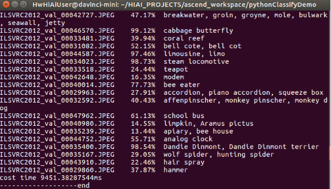

English|[中文](Readme_CN.md)

# Classification Network Application \(Python\)

This application can run on the Atlas 200 DK to implement the inference function of the ResNet-18 network and output images with inference result labels and confidence.

The current application adapts to  [DDK&RunTime](https://ascend.huawei.com/resources)  of 1.3.0.0 as well as 1.32.0.0 and later versions.

## Prerequisites

Before deploying this sample, ensure that:

-   Mind Studio  has been installed.

-   The Atlas 200 DK developer board has been connected to  Mind Studio, the SD card has been created, and the build environment has been configured.
-   The developer board is connected to the Internet over the USB port by default. The IP address of the developer board is  **192.168.1.2**.

## Software Preparation

Before running this application, obtain the source code package and configure the environment as follows.

1.  Obtain the source code package.
    1.  By downloading the package

        Download all code in the repository at  [https://github.com/Atlas200dk/sample-classification-python](https://github.com/Atlas200dk/sample-classification-python)  to any directory on Ubuntu Server where  Mind Studio  is located as the  Mind Studio  installation user, for example,  **$HOME/sample-classfication-python**.

    2.  By running the  **git**  command

        Run the following command in the  **$HOME/AscendProjects**  directory to download code:

        **git clone https://github.com/Atlas200dk/sample-classfication-python.git**

2.  Obtain the network model required by the application.

    Refer to  [Table 1](#table1119094515272)  to obtain the source network model used in this application and the corresponding weight file. Save them to any directory of the Ubuntu server with  Mind Studio  installed, for example,  **$HOME/ascend/models/classification-python**.

    **Table  1**  Models used in the classification network application \(Python\)

    
    <table><thead align="left"><tr id="row677354502719"><th class="cellrowborder" valign="top" width="13%" id="mcps1.2.4.1.1">
Model Name

    </th>
    <th class="cellrowborder" valign="top" width="26%" id="mcps1.2.4.1.2">
Description

    </th>
    <th class="cellrowborder" valign="top" width="61%" id="mcps1.2.4.1.3">
Download Path

    </th>
    </tr>
    </thead>
    <tbody><tr id="row3122314144215"><td class="cellrowborder" valign="top" width="13%" headers="mcps1.2.4.1.1 ">
resnet18

    </td>
    <td class="cellrowborder" valign="top" width="26%" headers="mcps1.2.4.1.2 ">
Image classification inference model.

    
It is a ResNet 18 model based on Caffe.

    </td>
    <td class="cellrowborder" valign="top" width="61%" headers="mcps1.2.4.1.3 ">
Download the source network model file and its weight file by referring to <strong id="b1728815118918">README.md</strong> at <a href="https://github.com/Ascend-Huawei/models/tree/master/computer_vision/classification/resnet18" target="_blank" rel="noopener noreferrer">https://github.com/Ascend-Huawei/models/tree/master/computer_vision/classification/resnet18</a>.

    </td>
    </tr>
    </tbody>
    </table>

3.  Convert the source network model to a model supported by the Ascend AI processor.
    1.  Choose  **Tools \> Model Convert**  from the main menu of  Mind Studio.
    2.  On the  **Model Conversion**  page, set  **Model File**  and  **Weight File**  to the model file and weight file downloaded in  [1](#li953280133816), respectively.
        -   Set  **Model Name**  to the model name in  [Table 1](#table1119094515272).
        -   Retain default values for other parameters.

    3.  Click  **OK**  to start model conversion.

        After a model of 1.1.0.0 or 1.3.0.0 version is successfully converted, a .om offline model is generated in the  **$HOME/tools/che/model-zoo/my-model/xxx**  directory.

        After a model of 1.32.0.0 or a later version is successfully converted, an .om offline model is generated in the  **$HOME/modelzoo/xxx/device/xxx.om**  directory.

    4.  Upload the converted .om model file to the  **sample-classification-python/classificationapp/models**  directory under the source code path in  [Step 1](#li953280133816).

## Environment Deployment

1.  Copy the application code to the developer board.

    Go to the root directory of the classification network application \(python\) code as the  Mind Studio  installation user, for example,  **$HOME/sample-classificition-python**, and run the following command to copy the application code to the developer board:

    **scp -r ../sample-classificition-python/ HwHiAiUser@192.168.1.2:/home/HwHiAiUser/HIAI\_PROJECTS**

    Enter the password of the developer board as prompted. The default password is  **Mind@123**, as shown in  [Figure 1](#en-us_topic_0198304761_fig1660453512014).

    **Figure  1**  Copying application code  
    

    

    Log in to the host side as the  **HwHiAiUser**  user in SSH mode on Ubuntu Server where  Mind Studio  is located.

    **ssh HwHiAiUser@192.168.1.2**

    Switch to the  **root**  user. The default password of the  **root**  user on the Atlas DK developer board is  **Mind@123**.

    **su root**

2.  Configure the network connection of the developer board.

    Configure the network connection of the Atlas DK developer board by referring to  [https://github.com/Atlas200dk/sample-README/tree/master/DK\_NetworkConnect](https://github.com/Atlas200dk/sample-README/tree/master/DK_NetworkConnect).

3.  Install the environment dependency.

    Configure the environment dependency by referring to  [https://github.com/Atlas200dk/sample-README/tree/master/DK\_Environment](https://github.com/Atlas200dk/sample-README/tree/master/DK_Environment).

## Application Running

1.  Switch to the  **HwHiAiUser**  user and go to the directory where the classification network application code is located.

    **su HwHiAiUser**

    **cd \~/HIAI\_PROJECTS/sample-classificition-python/classificationapp**

2.  Run the application.

    Run the  **classify.py**  script to print the inference result on the execution terminal.

    Command example:

    **python classify.py**

    [Figure 2](#fig1863053617417)  shows the inference result after the execution is successful.

    **Figure  2**  Successful inference  
    

    

3.  Query the execution result.

    The execution result is stored in  **resent18Result**  of the current directory. You need to run the following command on the Atlas200 DK to copy the result to the Ubuntu server to view the inference result image:

    **scp -r username@host\_ip:/home/username/HIAI\_PROJECTS/sample-classification-python/resent18Result \~**

    -   **username**: user name of the developer board. The default value is  **HwHiAiUser**.
    -   **host\_ip**: IP address of the developer board. Generally, the IP address is  **192.168.1.2**  for USB connection and  **192.168.0.2**  for network cable connection.

    Command example:

    **scp -r HwHiAiUser@192.168.1.2:/home/HwHiAiUser/HIAI\_PROJECTS/sample-classification-python/resent18Result \~**

    This command copies the inference result to the home directory of the Mind Studio installation user. You can view the inference result directly.

## Remarks

-   The process of the classification network application \(Python\) is as follows:
    1.  Read a JPEG image from the  **ImageNetRaw**  directory.
    2.  Call OpenCV to resize the read JPEG image to 256 x 224 and convert it to YUV420SP.
    3.  Send the converted YUV420SP image data to Matrix for inference. The demo uses the ResNet-18 network, and the inference result is the confidence of 1000 classes.
    4.  Post-process the image. 1000 classification confidence levels are sorted, the highest confidence level and its classification label are selected, and the image is labeled. A labeled image is stored in the  **resnet18Result**  directory.

-   The directory structure of the classification network application \(Python\) is described as follows:
    -   **ImageNetRaw**: storing input images
    -   **classify.py**: main program
    -   **imageNetClasses.py**: labeling for 1000 classes of ImageNet
    -   **jpegHandler.py**: JPEG image processing, such as resizing, color space conversion \(CSC\), and text labeling
    -   **models**: storing model networks
    -   **resnet18Result**: storing labeled images

