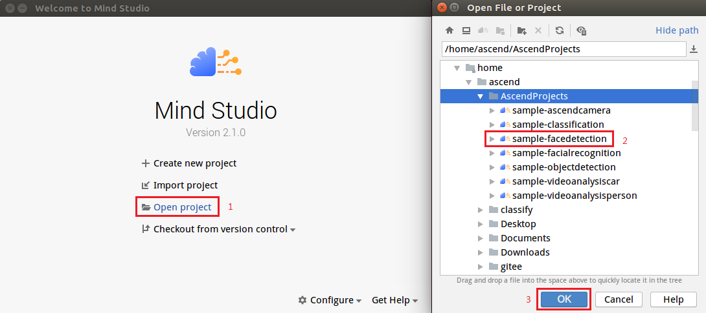
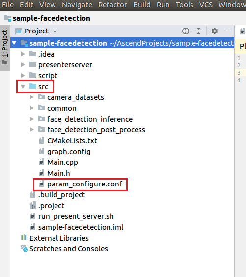
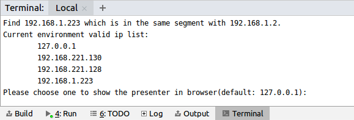
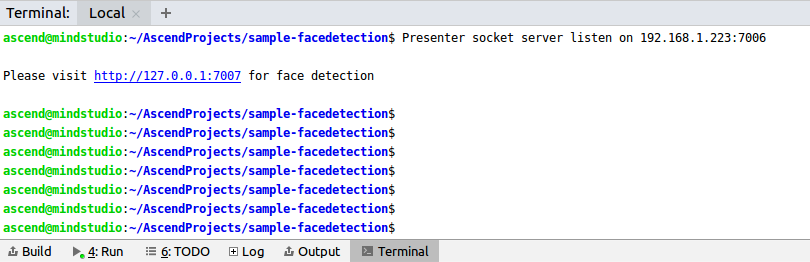
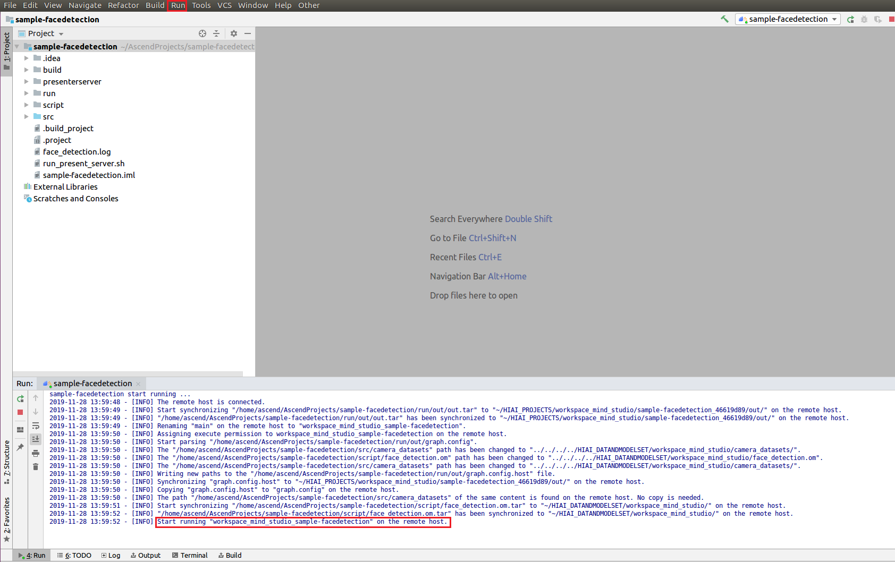

English|[中文](Readme_cn.md)

# Face Detection<a name="EN-US_TOPIC_0203223294"></a>

You can deploy this application on the Atlas 200 DK to collect camera data in real time and predict facial information in the video.

The applications in the current version branch adapt to  [DDK&RunTime](https://ascend.huawei.com/resources) **1.32.0.0 and later**.

## Prerequisites<a name="section137245294533"></a>

Before deploying this sample, ensure that:

-   Mind Studio  has been installed.
-   The Atlas 200 DK developer board has been connected to  Mind Studio, the cross compiler has been installed, the SD card has been prepared, and basic information has been configured.

## Software Preparation<a name="section081240125311"></a>

Before running this sample, obtain the source code package, configure the environment, and prepare a model file as follows:

1.  <a name="li953280133816"></a>Obtain the source code package.
    1.  By downloading the package

        Download all the code in the repository at  [https://github.com/Atlas200dk/sample-facedetection/tree/1-3x-0-0/](https://github.com/Atlas200dk/sample-facedetection/tree/1-3x-0-0/)  to any directory on Ubuntu Server where Mind Studio is located as the Mind Studio installation user, for example,  _$HOME/AscendProjects/sample-facedetection_.

    2.  By running the  **git**  command

        Run the following command in the  **$HOME/AscendProjects**  directory to download code:

        **git clone https://github.com/Atlas200dk/sample-facedetection.git --branch 1-3x-0-0**

2.  <a name="li1365682471610"></a>Obtain the source network model required by the application.

    Obtain the source network model and its weight file used in the application by referring to  [Table 1](#table144841813177)  and save them to the same directory on Ubuntu Server where Mind Studio is located, for example,  **$HOME/models/facedetection**.

    **Table  1**  Models used for face detection

    <a name="table144841813177"></a>
    <table><thead align="left"><tr id="row161061318181712"><th class="cellrowborder" valign="top" width="18%" id="mcps1.2.4.1.1"><p id="p1410671814173"><a name="p1410671814173"></a><a name="p1410671814173"></a>Model Name</p>
    </th>
    <th class="cellrowborder" valign="top" width="19%" id="mcps1.2.4.1.2"><p id="p1106118121716"><a name="p1106118121716"></a><a name="p1106118121716"></a>Description</p>
    </th>
    <th class="cellrowborder" valign="top" width="63%" id="mcps1.2.4.1.3"><p id="p14106218121710"><a name="p14106218121710"></a><a name="p14106218121710"></a>Download Path</p>
    </th>
    </tr>
    </thead>
    <tbody><tr id="row1710661814171"><td class="cellrowborder" valign="top" width="18%" headers="mcps1.2.4.1.1 "><p id="p13106121801715"><a name="p13106121801715"></a><a name="p13106121801715"></a>face_detection</p>
    </td>
    <td class="cellrowborder" valign="top" width="19%" headers="mcps1.2.4.1.2 "><p id="p13106171831710"><a name="p13106171831710"></a><a name="p13106171831710"></a>Network model for face detection.</p>
    <p id="p18106718131714"><a name="p18106718131714"></a><a name="p18106718131714"></a>It is converted from the Caffe-based ResNet10-SSD300 model.</p>
    </td>
    <td class="cellrowborder" valign="top" width="63%" headers="mcps1.2.4.1.3 "><p id="p110671813170"><a name="p110671813170"></a><a name="p110671813170"></a>Download the source network model file and its weight file by referring to<strong id="b183186571086"><a name="b183186571086"></a><a name="b183186571086"></a> README.md</strong> at <a href="https://github.com/Ascend-Huawei/models/tree/master/computer_vision/object_detect/face_detection" target="_blank" rel="noopener noreferrer">https://github.com/Ascend-Huawei/models/tree/master/computer_vision/object_detect/face_detection</a>.</p>
    </td>
    </tr>
    </tbody>
    </table>

3.  Log in to Ubuntu Server where Mind Studio is located as the Mind Studio installation user, determine the current DDK version number, and set the environment variables  **DDK\_HOME**,  **tools\_version**,  **LD\_LIBRARY\_PATH**.
    1.  <a name="li61417158198"></a>Query the current DDK version number.

        A DDK version number can be queried by using either Mind Studio or the DDK software package.

        -   Using Mind Studio

            On the project page of Mind Studio, choose  **File \> Settings \> System Settings \> Ascend DDK**  to access  [Querying the DDK version number](#fig17553193319118).

            **Figure  1**  Querying the DDK version number<a name="fig17553193319118"></a>  
            

            The displayed  **DDK Version**  is the current DDK version number, for example,  **1.31.T15.B150**.

        -   Using the DDK software package

            Obtain the DDK version number based on the DDK package name.

            DDK package name format:  **Ascend\_DDK-\{software version\}-\{interface version\}-x86\_64.ubuntu16.04.tar.gz**

            _Software version_  indicates the DDK software version number.

            For example:

            If the DDK package name is  **Ascend\_DDK-1.31.T15.B150-1.1.1-x86\_64.ubuntu16.04.tar.gz**, the DDK version is  **1.31.T15.B150**.

    2.  Set environment variables.

        **vim \~/.bashrc**

        Run the following commands to add the environment variables  **DDK\_HOME**  and  **LD\_LIBRARY\_PATH**  to the last line:

        **export tools\_version=_1.31.X.X_**

        **export DDK\_HOME=\\$HOME/.mindstudio/huawei/ddk/\\$tools\_version/ddk**

        **export LD\_LIBRARY\_PATH=$DDK\_HOME/lib/x86\_64-linux-gcc5.4**

        > **NOTE:**   
        >-   **_1.31.X.X_**  indicates the DDK version queried in  [a](#li61417158198). Set this parameter based on the query result, for example,  **1.31.T15.B150**.  
        >-   If the environment variables have been added, skip this step.  

        Type  **:wq!**  to save settings and exit.

        Run the following command for the environment variable to take effect:

        **source \~/.bashrc**

4.  Convert the source network model to a model supported by the Ascend AI processor. A model can be converted either using Mind Studio or in CLI mode.
    -   Convert a model using Mind Studio.
        1.  Choose  **Tools \> Model Convert**  from the main menu of Mind Studio.
        2.  In the  **Model** **Conversion**  window, configure model conversion, as shown in  [face\_detection model conversion configuration](#fig206931026131712).

            **Figure  2**  face\_detection model conversion configuration<a name="fig206931026131712"></a>  
            

            

            -   Select the model file downloaded in  [Step 2](#li1365682471610)  for  **Model File**. The weight file is automatically matched and filled in  **Weight File**.
            -   Set  **Model Name**  to the model name  **face\_detection**  in  [Table 1](#table144841813177).

        3.  Click  **Next**  to go to the  **Nodes**  configuration page.

            **Figure  3**  Nodes configuration example<a name="fig3754173017185"></a>  
            

            

        4.  Click  **Next**  to go to the  **Quantization**  configuration page.

            Switch off  **Quantization Configuration**  to disable quantization.

        5.  Click  **Next**  to go to the  **AIPP**  configuration page. Change the values of  **Input Image Size\[W\]\[H\]**  to  **384**  and  **304**  respectively. The values must be 128 x 16 aligned. Select  **BGR888\_U8**  for  **Model Image Format**. Retain the default values for other options, as shown in  [Figure 4](#fig1682055223010).

            **Figure  4**  AIPP configuration<a name="fig1682055223010"></a>  
            

        6.  Click  **Finish**  to start model conversion.

            During the conversion, the error information shown in  [Figure 5](#fig2865313121718)  is displayed.

            **Figure  5**  Model conversion error<a name="fig2865313121718"></a>  
            

            

            Select  **SSDDetectionOutput**  from the  **Suggestion**  drop-down list box at the  **DetectionOutput**  layer and click  **Retry**.

            After successful conversion, an .om offline model is generated in the  **$HOME/modelzoo/face\_detection/device**  directory.

            > **NOTE:**   
            >For details about the descriptions of each step and parameters in model conversion, see "Model Conversion" in the  [Mind Studio User Guide](https://ascend.huawei.com/doc/mindstudio/).  


    -   Convert a model in CLI mode.
        1.  Go to the folder for storing original models as the Mind Studio installation user.

            **cd $HOME/models/facedetection**

        2.  Run the following command to convert the model using OMG:

            ```
            ${DDK_HOME}/uihost/bin/omg --output="./face_detection" --model="./face_detection.prototxt" --framework=0 --ddk_version=${tools_version} --weight="./face_detection.caffemodel" --input_shape=`head -1 $HOME/AscendProjects/sample-facedetection/script/shape_face_detection` --insert_op_conf=$HOME/AscendProjects/sample-facedetection/script/aipp_face_detection.cfg --op_name_map=$HOME/AscendProjects/sample-facedetection/script/reassign_operators
            ```

            > **NOTE:**   
            >-   The files required by  **input\_shape**,  **insert\_op\_conf**, and  **op\_name\_map**  are stored in the  **sample-facedetection/script**  directory under the source code path. Configure the file paths based on the actual source code path.  
            >-   For details about parameter descriptions, see "Model Conversion" in the  [Atlas 200 DK User Guide](https://ascend.huawei.com/doc/atlas200dk/).  


5.  Upload the converted .om model file to the  **sample-facedetection/script**  directory under the source code path in  [1](#li953280133816).

## Building a Project<a name="section7994174585917"></a>

1.  Open the project.

    Go to the directory that stores the decompressed installation package as the Mind Studio installation user in CLI mode, for example,  **$HOME/MindStudio-ubuntu/bin**. Run the following command to start Mind Studio:

    **./MindStudio.sh**

    Open the  **sample-facedetection**  project, as shown in  [Figure 6](#fig05481157171918).

    **Figure  6**  Opening the facedetection project<a name="fig05481157171918"></a>  
    

    

2.  Configure project information in the  **src/param\_configure.conf**  file.

    For details, see  [Figure 7](#fig0391184062214).

    **Figure  7**  Configuration file<a name="fig0391184062214"></a>  
    

    

    Content of the configuration file:

    ```
    remote_host=
    data_source=
    presenter_view_app_name=
    ```

    -   **remote\_host**: IP address of the Atlas 200 DK developer board
    -   _data\_source_: camera channel. The value can be  **Channel-1**  or  **Channel-2**. For details, see  **Viewing the Channel to Which a Camera Belongs**  in  [Atlas 200 DK User Guide](https://ascend.huawei.com/documentation).
    -   _presenter\_view\_app\_name_: value of  **View Name**  on the  **Presenter Server**  page, which must be unique. The value consists of at least one character and supports only uppercase letters, lowercase letters, digits, and underscores \(\_\).

    Configuration example:

    ```
    remote_host=192.168.1.2
    data_source=Channel-1
    presenter_view_app_name=video
    ```

    > **NOTE:**   
    >-   All the three parameters must be set. Otherwise, the build fails.  
    >-   Do not use double quotation marks \(""\) during parameter settings.  

3.  Run the  **deploy.sh**  script to adjust configuration parameters and download and compile the third-party library. Open the  **Terminal**  window of Mind Studio. By default, the home directory of the code is used. Run the  **deploy.sh**  script in the background to deploy the environment, as shown in  [Executing the deploy script](#fig107831626101910).

    **Figure  8**  Execute the deploy script.<a name="fig107831626101910"></a>  
    

    > **NOTE:**   
    >-   During the first deployment, if no third-party library is used, the system automatically downloads and compiles a third-party library, which may take a long time. The third-party library can be directly used for the subsequent compilation.  
    >-   During deployment, select the IP address of the host that communicates with the developer board. Generally, the IP address is that configured for the virtual NIC. If the IP address is in the same network segment as the IP address of the developer board, it is automatically selected for deployment. If they are not in the same network segment, you need to manually type the IP address of the host that communicates with the Atlas 200 DK to complete the deployment.  

4.  Start the build. Open Mind Studio and choose  **Build \> Build \> Build-Configuration**  from the main menu. The  **build**  and  **run**  folders are generated in the directory, as shown in  [Figure 9](#fig1625447397).

    **Figure  9**  Build and file generating<a name="fig1625447397"></a>  
    

    

    > **NOTICE:**   
    >When you build a project for the first time,  **Build \> Build**  is unavailable. You need to choose  **Build \> Edit Build Configuration**  to set parameters before the build.  

5.  <a name="li499911453439"></a>Start Presenter Server.

    Open the  **Terminal**  window of Mind Studio. Under the code storage path, run the following command to start the Presenter Server program of the face detection application on the server, as shown in  [Figure 10](#fig423515251067):

    **bash run\_present\_server.sh**

    **Figure  10**  Starting Presenter Server<a name="fig423515251067"></a>  
    

    

    When the message  **Please choose one to show the presenter in browser\(default: 127.0.0.1\):**  is displayed, type the IP address \(usually IP address for accessing Mind Studio\) used for accessing the Presenter Server service in the browser.

    Select the IP address used by the browser to access the Presenter Server service in  **Current environment valid ip list**, as shown in  [Figure 11](#fig999812514814).

    **Figure  11**  Project deployment<a name="fig999812514814"></a>  
    

    

    [Figure 12](#fig69531305324)  shows that the presenter\_server service is started successfully.

    **Figure  12**  Starting the Presenter Server process<a name="fig69531305324"></a>  
    

    

    Use the URL shown in the preceding figure to log in to Presenter Server \(only Google Chrome is supported\). The IP address is that typed in  [Figure 11](#fig999812514814)  and the default port number is  **7007**. The following figure indicates that Presenter Server has been started successfully.

    **Figure  13**  Home page<a name="fig64391558352"></a>  
    

    The following figure shows the IP address used by Presenter Server and  Mind Studio  to communicate with the Atlas 200 DK.

    **Figure  14**  IP address example<a name="fig1881532172010"></a>  
    

    Where:

    -   The IP address of the Atlas 200 DK developer board is  **192.168.1.2**  \(connected in USB mode\).
    -   The IP address used by the Presenter Server to communicate with the Atlas 200 DK is in the same network segment as the IP address of the Atlas 200 DK on the UI Host server. For example:  **192.168.1.223**.
    -   The following describes how to access the IP address \(such as  **10.10.0.1**\) of Presenter Server using a browser. Because Presenter Server and  Mind Studio  are deployed on the same server, you can access  Mind Studio  through the browser using the same IP address. 


## Running<a name="section551710297235"></a>

1.  Run the face detection application.

    On the toolbar of Mind Studio, click  **Run**  and choose  **Run \> Run 'sample-facedetection'**. As shown in  [Figure 15](#fig93931954162719), the executable program is running on the developer board.

    **Figure  15**  Application running sample<a name="fig93931954162719"></a>  
    

    

2.  Use the URL displayed upon the start of the Presenter Server service to log in to Presenter Server. For details, see  [Start Presenter Server](#li499911453439).

    Wait for Presenter Agent to transmit data to the server. Click  **Refresh**. When there is data, the icon in the  **Status**  column for the corresponding channel changes to green, as shown in the following figure.

    **Figure  16**  Presenter Server page<a name="fig113691556202312"></a>  
    

    > **NOTE:**   
    >-   For the face detection application, Presenter Server supports a maximum of 10 channels at the same time \(each  _presenter\_view\_app\_name_  parameter corresponds to a channel\).  
    >-   Due to hardware limitations, each channel supports a maximum frame rate of 20 fps. A lower frame rate is automatically used when the network bandwidth is low.  

3.  Click the link \(such as  **video**  in the preceding figure\) in the  **View Name**  column to view the result. The confidence of the detected human face is marked.

## Follow-up Operations<a name="section177619345260"></a>

-   **Stopping the Face Detection Application**

    The face detection application is running continually after being executed. To stop it, perform the following operation:

    Click the stop button shown in  [Figure 17](#fig14326454172518)  to stop the face detection application.

    **Figure  17**  Stopping the Face Detection application<a name="fig14326454172518"></a>  
    

    

    [Figure 18](#fig2182182518112)  shows that the face detection application has been stopped.

    **Figure  18**  Stop of the face detection application<a name="fig2182182518112"></a>  
    

    

-   **Stopping the Presenter Server Service**

    The Presenter Server service is always in running state after being started. To stop the Presenter Server service for the face detection application, perform the following operations:

    On the server with  Mind Studio  installed, run the following command as the  Mind Studio  installation user to check the process of the Presenter Server service corresponding to the face detection application:

    **ps -ef | grep presenter | grep face\_detection**

    ```
    ascend@ascend-HP-ProDesk-600-G4-PCI-MT:~/sample-facedetection$ ps -ef | grep presenter | grep face_detection
    ascend    7701  1615  0 14:21 pts/8    00:00:00 python3 presenterserver/presenter_server.py --app face_detection
    ```

    In the preceding information,  _7701_  indicates the process ID of the Presenter Server service for the face detection application.

    To stop the service, run the following command:

    **kill -9** _7701_


